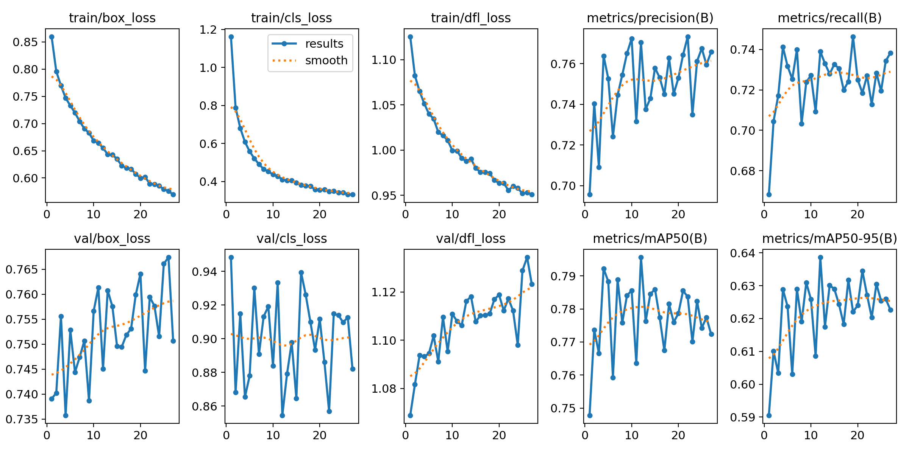
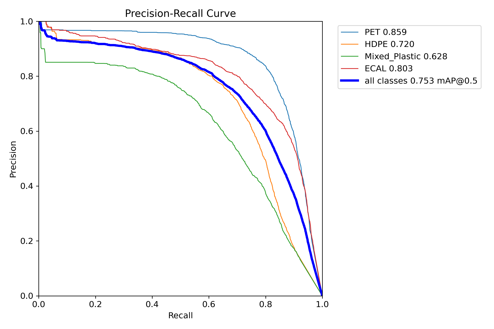
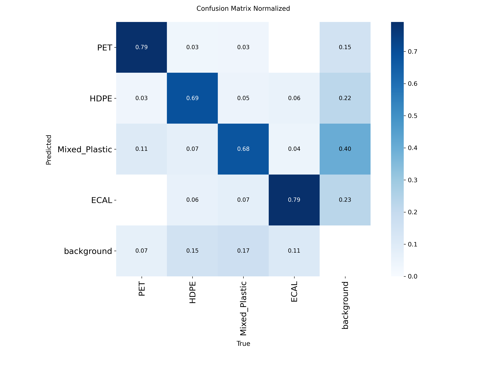
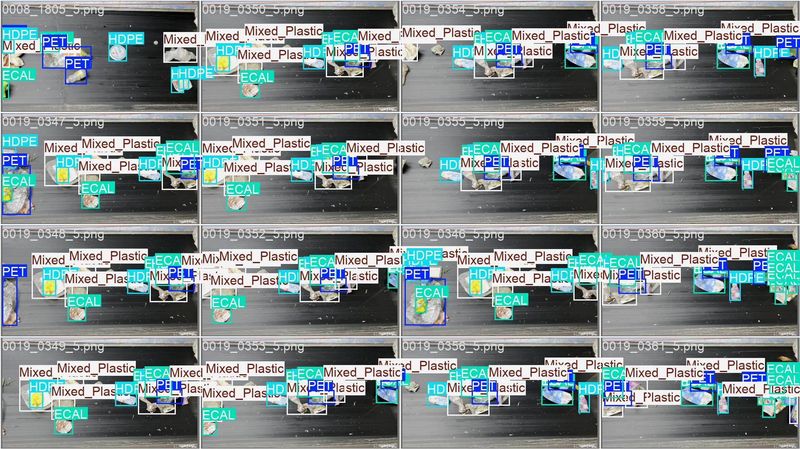
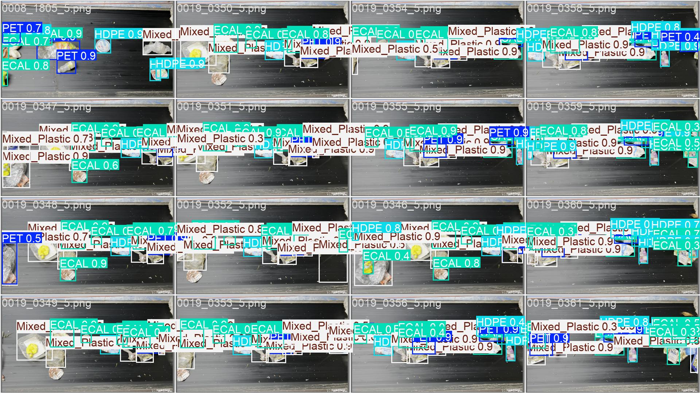

# SortWaste — YOLOv8 Reproduction

A reproduction of Inácio, Proença, Neves (2026), *SortWaste: A Densely
Annotated Dataset for Object Detection in Industrial Waste Sorting*
(arXiv:2601.02299), substituting **YOLOv8m** for the paper's YOLOv11. On the
4-class plastic split, this run reaches **overall AP50 0.753 vs the paper's
0.753** and **AP 0.598 vs 0.597** — indistinguishable from the paper's
YOLOv11 within run-to-run noise. Scope is the 4-class plastic benchmark only;
the paper's 8-class benchmark and ClutterScore robustness analysis were not
reproduced.

## Headline result

| Metric            | YOLOv8m (this work) | YOLOv11 (paper Table 7) |
|-------------------|---------------------|-------------------------|
| Overall AP50      | 0.753               | 0.753                   |
| Overall AP(50-95) | 0.598               | 0.597                   |

Per-class AP50 ordering (PET > ECAL > HDPE > Mixed_Plastic) matches the paper
exactly. See [results/RESULTS.md](results/RESULTS.md) for the per-class table,
the full LR/optimizer sweep, and caveats.

## Performance figures

All figures below are from the winning run
(`yolov8m_4class_adamw_5e-04`). Source artifacts live under
`runs/train/.../` and `runs/eval/train_test/` (gitignored — regenerable via
`src/train.py` + `src/evaluate.py`); the copies in [docs/figures/](docs/figures/)
are tracked so they render here.

**Training curves (val mAP + losses across epochs)**



**Test-split precision-recall** (left) and **normalized confusion matrix**
(right). PR curve overall mAP@0.5 = 0.753; PET is the easiest class, Mixed_Plastic
the hardest — consistent with the paper.

| | |
|---|---|
|  |  |

**Sample test-batch detections.** Ground-truth labels (left) and YOLOv8m
predictions (right) on the same test batch.

| Ground truth | Predictions |
|---|---|
|  |  |

## What's in the repo

- [src/](src/) — training, eval, label verifiers, webcam demo
- [configs/](configs/) — Ultralytics data YAMLs (4-class and 8-class)
- [notebooks/](notebooks/) — EDA (`01_data_exploration.ipynb`) and Colab training driver (`02_colab_training.ipynb`)
- [results/](results/) — eval CSVs, comparison tables, [RESULTS.md](results/RESULTS.md)
- [CLAUDE.md](CLAUDE.md) — project context and full detail (read this first if you're working in the repo)
- [ProjectTimeline.md](ProjectTimeline.md) — running decision log

## Reproducing this

### Environment

```bash
conda create -n waste_vision python=3.10 -y
conda activate waste_vision
pip install -r requirements.txt
```

Verify GPU/MPS is wired up before training:

```bash
python -c "import torch; print('cuda', torch.cuda.is_available(), '/ mps', torch.backends.mps.is_available())"
```

### Dataset

SortWaste is not bundled with this repo (too large). Download `dataset.zip`
and `plastic_dataset.zip` from `<DATASET SOURCE TBD>`, extract them under
`data/sortwaste/sortwaste_raw/`, then materialize the training-ready trees:

```bash
python src/setup_yolo_trees.py
```

The script is idempotent — re-run it whenever `data/sortwaste/labels_<variant>/`
changes. Layout details are in [CLAUDE.md](CLAUDE.md) under "Data layout — why two trees".

### Training (Colab recommended)

GPU training of the full 300-epoch run is most practical on Colab — see
[notebooks/02_colab_training.ipynb](notebooks/02_colab_training.ipynb) for the
driver notebook. Local training works via `src/train.py` but is slow on CPU/MPS.

### Eval

Reproduce the winning run's test-set numbers:

```bash
python src/evaluate.py \
    --weights runs/train/yolov8m_4class_adamw_5e-04/train/weights/best.pt \
    --data configs/wastevision_4.yaml \
    --variant 4class --imgsz 1280 --split test \
    --out results/eval_yolov8m_4class_adamw_5e-04.csv \
    --device mps
```

## Live demo (optional)

[src/webcam_infer.py](src/webcam_infer.py) runs the trained detector on a live
webcam feed for visual demonstration. The model was trained on top-down
conveyor frames under uniform facility lighting, so handheld webcam input is
out of distribution — the demo illustrates the failure mode about as much as
the success mode.

## Citation

> Inácio, S., Proença, H., Neves, J. C. *SortWaste: A Densely Annotated
> Dataset for Object Detection in Industrial Waste Sorting.* arXiv:2601.02299,
> January 2026.

## License

License: TBD
